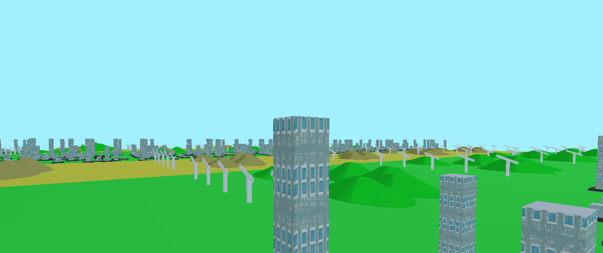

# Procedural-City-OpenGL
A minimalistic "procedurally generated" cityscape.My final lab project for CSE-426 Computer Graphics Course.
No shader programming is used.No complicated placement algorithm is used just placed everything randomly.
# Screenshot

